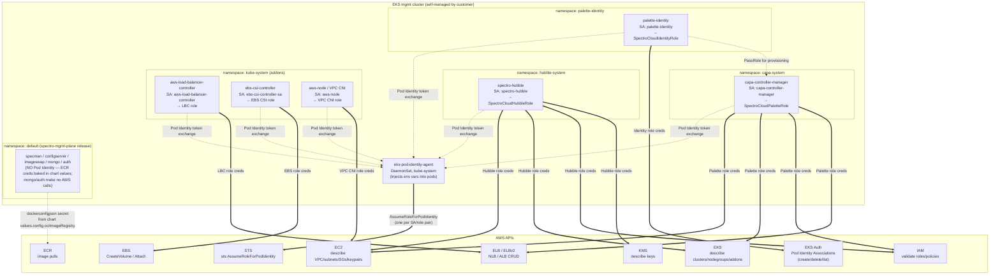
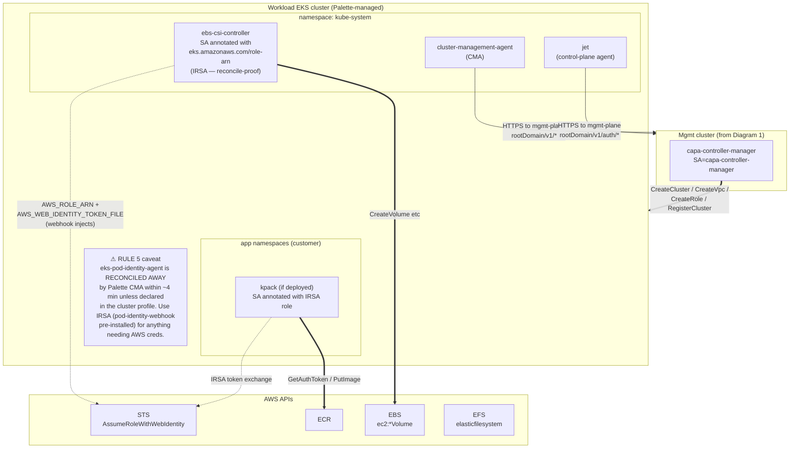

# Architecture — Palette VerteX mgmt-plane with EKS Pod Identity

Two Mermaid diagrams: mgmt-plane at rest, and the workload-cluster provisioning
path. Both render natively in GitHub.

## Diagram 1 — Mgmt cluster components and their AWS auth path

**Legend:**

- `-.->` = env-var injection or credential-material path
- `==>` = actual AWS API call
- Each mgmt-plane pod that needs AWS talks first to the local Pod Identity
  agent DaemonSet; the agent handles the STS token exchange; the pod gets
  temp creds and uses them for the real AWS call.
- ECR access from chart components (`specman` / `configserver` / `imageswap`)
  does NOT go through Pod Identity — the chart's
  `config.ociImageRegistry.username/password` values bake registry creds into
  a Kubernetes Secret at install time. Pod Identity for ECR is possible but
  not the pattern this chart uses.

## Diagram 2 — Workload cluster provisioning + phone-home

**Why the two workload-cluster diagrams differ from mgmt cluster:**

| Aspect | Mgmt cluster | Workload cluster |
|---|---|---|
| Ownership | Self-managed (you own kubelet, addons, everything) | Palette-managed (CMA reconciles state) |
| Pod Identity addon | Present, stable | Removed by Palette within ~4 min unless in profile |
| Standard AWS-auth pattern | Pod Identity Associations | IRSA on SA annotations (survives reconciliation) |
| Node role IAM policies | Whatever you attach stays | `spectro__ownerUid`-tagged; managed-policy attachments reconciled off |

Recommendation: use Pod Identity on the mgmt cluster (this diagram),
use IRSA on workload clusters (`paihub-kpack-irsa.md` pattern) unless you
explicitly declare the Pod Identity addon in the cluster profile.
